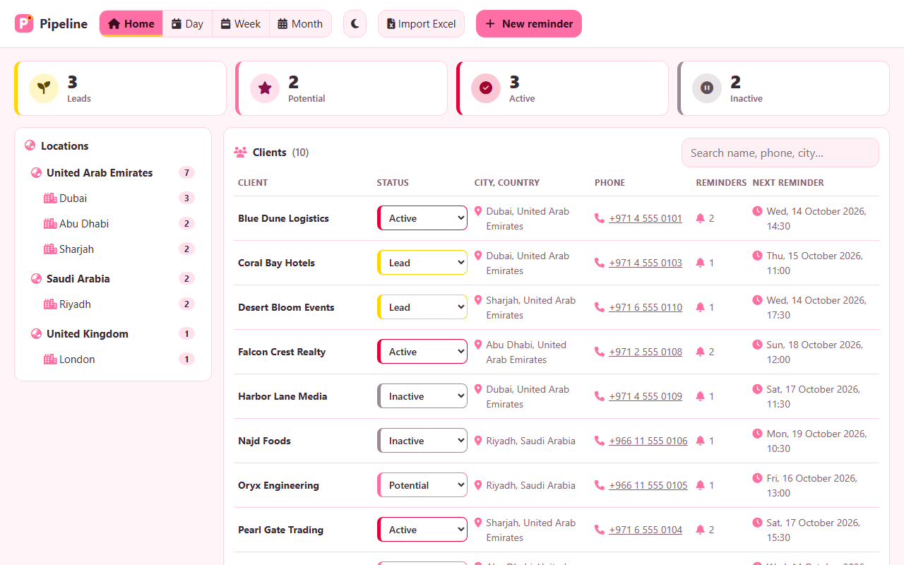
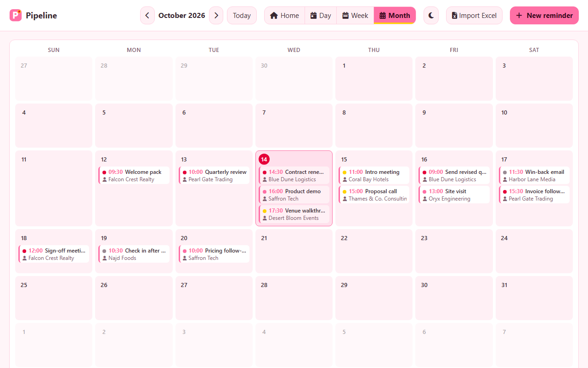
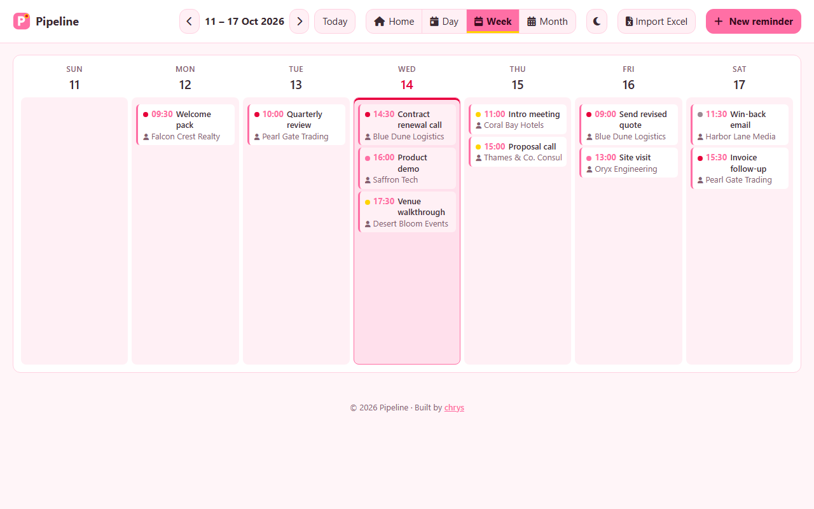
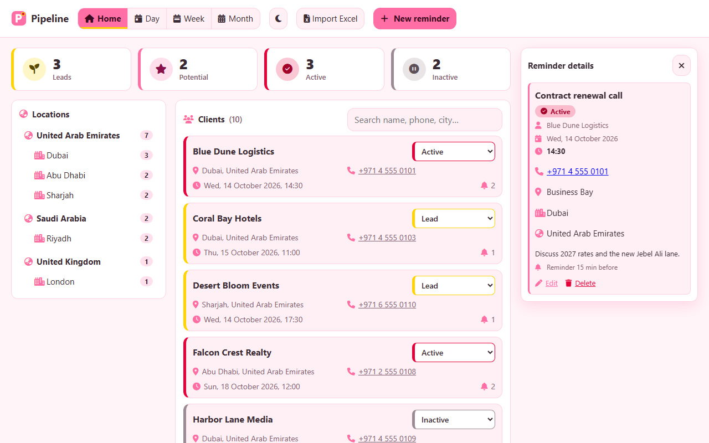
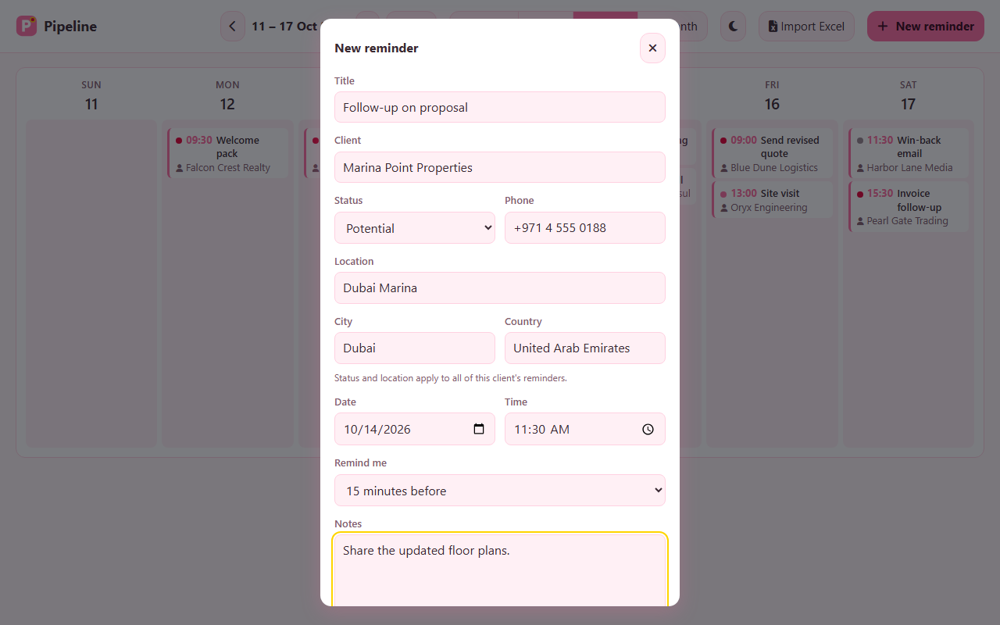
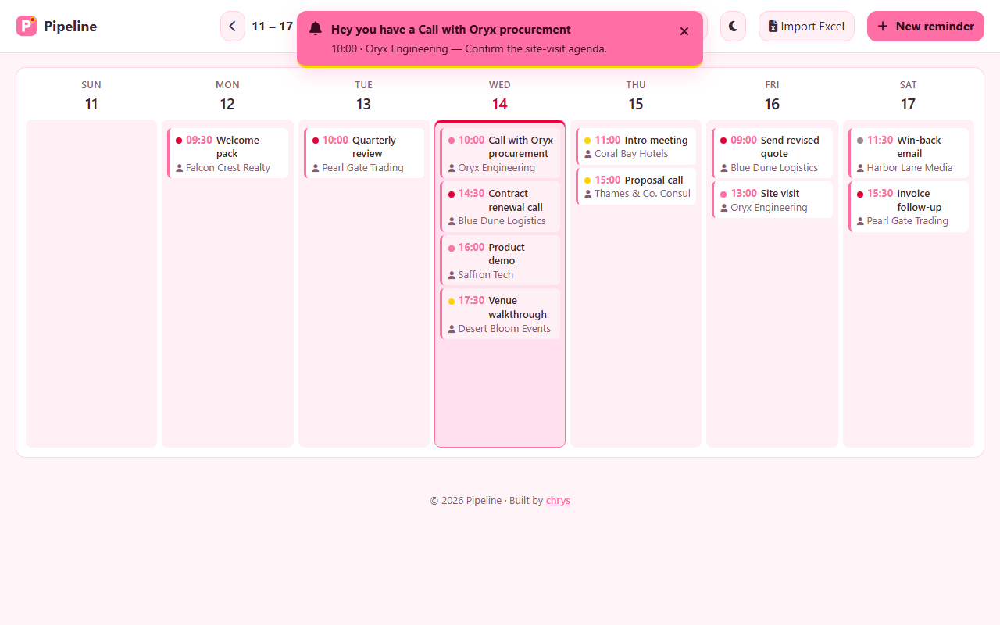
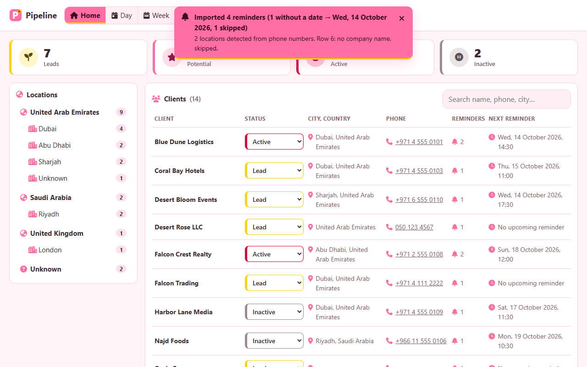
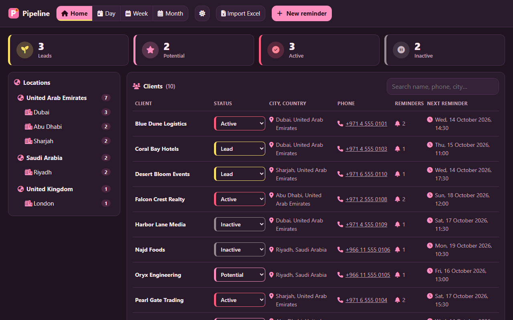
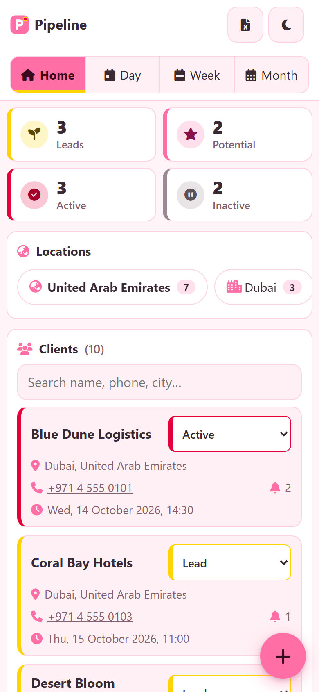
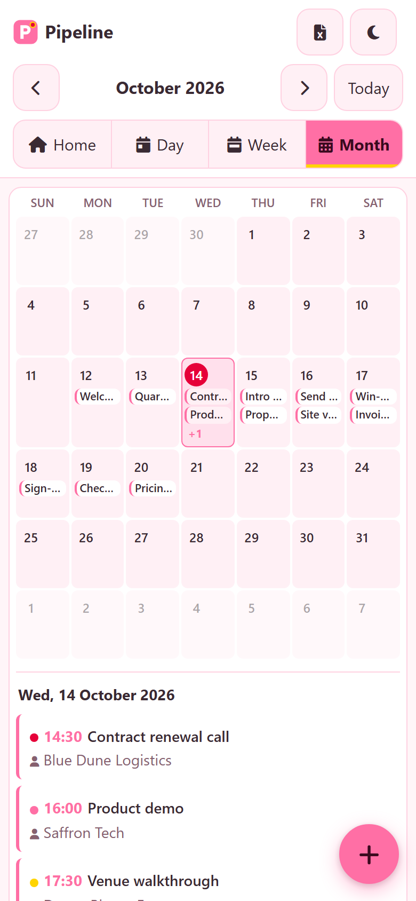

<p align="center">
  
</p>

<h1 align="center">CladFlo — Client Reminders &amp; BD Calendar</h1>

<p align="center">
  Track leads, potential, active and inactive clients, get real-time reminders, and turn BD notes from Excel into a calendar.
  <br>
  <a href="https://pipeline-9944d.web.app"><strong>Open the live app →</strong></a>
</p>



## Features

### Home dashboard: statuses and locations

Every client in one place. Four cards count your **Leads**, **Potential**,
**Active** and **Inactive** clients; click one to filter. Locations are grouped
by country, then city, with counts: click one to see those clients. Search by
name, phone or city, and change a client's status right in the list. Clicking a
client opens their next reminder.

### Day, Week and Month views

Like Google Calendar. Each reminder shows its time, title, client and a status
dot. Switch with the buttons or the keys `H` (Home), `D`, `W`, `M`; `←` / `→`
move by the current view and `T` jumps to today.

| Month | Week |
|---|---|
|  |  |

### Reminder details

Click a reminder's title to open its details: status, client, date and time,
phone, location, city, country and notes, with Edit and Delete.



### New reminder with status and location

A client has one status and one location: saving a reminder copies them to all
of that client's reminders. Type a phone number and the city and country fill
in on their own (`+971 4…` → Dubai, `+966 11…` → Riyadh, `05…` → UAE).



### Real-time popups

Reminders are checked every few seconds. When one is due you get a desktop
notification — **"Hey you have a {title}"** — that stays until you dismiss it,
plus an in-app banner. Click either to open the reminder.



### Excel import

Import an `.xlsx`, `.xls` or `.csv` export: one reminder per company, dated from
the BD notes, with city and country read from the phone numbers.
Re-importing updates the same reminders instead of duplicating them, and never
overwrites a status you set by hand. See [Excel format](#excel-format).



### Dark and light mode

Hello Kitty colours (pink, bow red, yellow), colour only. The sun/moon button
switches; with no choice the system setting is used.



### Mobile

Built for phones too: a 3-row top bar, a floating **+** button, a compact month
grid with the selected day's agenda underneath, swipe left/right to move, and
the details as a bottom sheet. Every button is at least 44 px.

| Home | Month |
|---|---|
|  |  |

### Firebase sync and Google sign-in

Sign in with Google and your reminders live in Firestore, synced live across
your PC, phone and every open tab, and cached for offline use. Each person can
only read and write their own data. Reminders already saved in the browser are
moved to the cloud once, on the first sign-in.

### Meeting minutes (free, with Groq)

Open **Minutes** (or press `N`), pick the client and date, then paste a
transcript or import a `.txt`, `.md`, `.vtt` or `.srt` file. **Generate** sends
it to Groq's free API: long transcripts go part by part ("Part 2 of 5…") and
are merged into one set of minutes (title, attendees, summary, decisions,
action items with owner and due date). Edit anything, then **Save minutes**.
Only the minutes are saved, never the transcript. Each client has its own
list of saved minutes, with Copy and Delete.

Each teammate uses their own free Groq key: create one at
[console.groq.com](https://console.groq.com/keys), then paste it in
**Settings** (gear) → **AI settings**. The key is stored in that browser only.
It is never synced to Firebase, never logged, and not part of `.env` or the build.
The model is Llama 3.3 70B by default; Llama 3.1 8B is faster and has higher
free limits. Busy (429) and server errors are retried up to 5 times.

### History log

**History** (or `L`) lists every change, newest first: reminders created,
edited or deleted, status changes, imports, minutes saved or deleted, and
Clear all. Filter by action or client, or search. The newest 500 entries are
kept, synced like the reminders.

### Clear all data

**Settings** → **Data** → type `CLEAR` → **Clear all data** deletes every
reminder and every set of minutes (in your account, or in this browser in
local mode). One History entry records it; the History log itself is kept.

## Tech stack

- **Vanilla HTML, CSS and JavaScript** (ES modules), no framework
- **Firebase**: Firestore (data), Authentication (Google sign-in), Hosting
- **SheetJS** for reading Excel files (loaded only when you import)
- **Font Awesome 6 Free** for icons
- **Playwright** for browser tests; a tiny built-in runner for unit tests

## Getting started

```bash
npm install
copy .env.example .env   # optional: fill in for Firebase sign-in (see below)
npm start            # → http://localhost:8000
```

Add `?backend=local` to the URL to keep everything in this browser (no sign-in).

```bash
npm test             # unit tests (Node)
npx playwright test  # browser tests: desktop, 390px phone, 360px phone, tablet
npm run build        # dist/: one self-contained index.html + assets
npm run deploy       # build + Firebase Hosting + Firestore rules
```

Other scripts: `npm run icons` re-renders every icon from `assets/logo.svg`,
and `npm run screenshots` retakes the images in this README (demo data only).

## Firebase setup (.env)

The Firebase settings live in a **`.env` file on your PC**, in the project
folder (next to `package.json`). Not in Firebase and not on GitHub: Firebase
Hosting serves a static site and doesn't store environment variables, so the
build reads `.env` and writes the values into `js/firebase-config.js`
(generated, git-ignored). `npm start`, `npm test` and `npm run build` do this
for you (`npm run config` on its own). With no `.env` the app runs in local
mode: no sign-in, reminders stay in the browser.

**Where to get the values:** [Firebase console](https://console.firebase.google.com)
→ your project → **Project settings** (⚙️ next to Project Overview) →
**General** → **Your apps** → your **Web app** (`</>`) →
**SDK setup and configuration** → **Config**. Copy each field:

| Firebase Config field | `.env` key |
|---|---|
| `apiKey` | `FIREBASE_API_KEY` |
| `authDomain` | `FIREBASE_AUTH_DOMAIN` |
| `projectId` | `FIREBASE_PROJECT_ID` |
| `storageBucket` | `FIREBASE_STORAGE_BUCKET` |
| `messagingSenderId` | `FIREBASE_MESSAGING_SENDER_ID` |
| `appId` | `FIREBASE_APP_ID` |

```bat
copy .env.example .env
rem open .env, paste the six values, save
npm start
npm run deploy
```

(`cp .env.example .env` on macOS/Linux.) Environment variables with the same
names override `.env`. `npm run deploy` refuses to run while a value is missing:
*"Fill in .env (copy .env.example): see README → Firebase setup"*.

**First time on a new Firebase project:** create the project, add a **Web app**,
create a **Firestore** database (production mode), enable **Google** under
Authentication → Sign-in method, put the project ID in `.firebaserc`, then
run `npx firebase-tools login` once (no global install needed; `npm run deploy`
also runs the CLI through npx).

**Is this a secret?** The Firebase *web* config is public by design: it ends up
in the built site, and every visitor's browser receives it. What protects your
data is `firestore.rules` (a signed-in user can read and write only
`users/{their uid}/…`; everything else is denied) plus restricting the key in
Google Cloud Console → APIs & Services → Credentials (allowed websites and
APIs). It is kept out of git so it can't be copied from the repo or flagged by
secret scanning.

**Optional, automatic deploys from GitHub:** put the same six keys under the
repo's **Settings → Secrets and variables → Actions**; a workflow that runs
`npm run build` picks them up as environment variables.

## Excel format

The first sheet with a **Company** column is used, one reminder per row that
has a company name.

| Column | Used for |
|---|---|
| `Company Name` (or `Company`) | The client. Title becomes `Follow up: {Company}`. |
| Other columns with "company" in the name | Listed under "Company details" in the notes. |
| `BD Notes` (any case, `BD_Notes`, `B.D. Notes`) | The full text goes into the notes; the reminder date is read from it. |
| Phone / Mobile / Tel / Contact number | Kept on the client; gives the city and country when those are blank. |
| `City`, `Country`, `Location` / `Address` / `Area` | Used as-is (they win over the phone number). |
| `Status` / `Stage` | `Lead`, `Potential`, `Active` or `Inactive`; otherwise Lead. |

**Dates** in the BD notes: `12/03/2026`, `12-03-2026`, `12.03.26`,
`2026-03-12`, `12 Mar 2026`, `Mar 12, 2026`, `12-Mar-26`, and `09-26` with no
year (the current year). Numbers are read **day first** (UAE style) unless that
is impossible. With several dates, the latest wins. A time right after it
(`14:30`, `2:30 pm`, `2pm`) becomes the reminder time; otherwise the time you
imported. No date → the day selected on the calendar.

**Phone numbers**: `+`, `00` or no prefix (read as UAE). UAE landlines give the
city (`02` Abu Dhabi, `03` Al Ain, `04` Dubai, `06` Sharjah/Ajman/UAQ, `07` Ras
Al Khaimah, `09` Fujairah), and so do Saudi ones (`11` Riyadh, `12` Jeddah, `13`
Dammam…). Mobiles and about 40 other country codes give the country only.
Dates and other text are never mistaken for phone numbers.

## Project layout

```
index.html               app shell, SEO / social tags
css/styles.css           core styles (light/dark, phone, tablet)
css/features.css         Minutes, History and Settings styles
assets/                  logo.svg, favicons, install icons, og-image, manifest, robots, sitemap
js/
  calendar.js            date and grid logic (pure)
  storage.js             reminder CRUD, statuses, client fields (pure)
  reminders.js           due reminders + notification loop
  phone-location.js      phone number → country / city (pure)
  importer.js            Excel rows → reminders (pure; SheetJS passed in)
  dashboard.js           clients, status counts, location tree, filters (pure)
  firebase-config.js     GENERATED from .env by npm run config (git-ignored)
  cloud.js               Firestore backend for any collection, diff and one-time migration
  records.js             meetings / history storage: this browser or users/{uid}/<name>
  history.js             History entries, filters, relative times (pure)
  transcript.js          .txt/.md/.vtt/.srt transcript → text, speakers, words (pure)
  groq.js                Groq key and model (this browser only), chat with retries, chunking
  minutes.js             two-step minutes prompts, JSON repair, Copy text (pure)
  record-store.js        live meetings and history lists
  theme.js               light / dark
  ui.js                  rendering (calendar, panel, dashboard, form)
  settings-ui.js         Settings modal: AI settings, Clear all data
  history-ui.js          History view
  minutes-ui.js          Minutes view
  app.js                 state, events, startup
build.mjs                bundles everything into dist/
scripts/                 gen-config (.env → config), check-firebase (deploy guard), make-icons, screenshots
docs/screenshots/        README images (npm run screenshots)
tests/                   unit tests (tests/run-node.mjs, or open tests/tests.html)
tests/web/               Playwright specs + dev server + fake Firebase
tests/fixtures/          sample.xlsx (made-up data; make-sample.mjs rebuilds it)
firebase.json            Hosting (serves dist/) + Firestore rules
firestore.rules          per-user access rules
.env.example             the six Firebase keys (copy to .env; .env is never committed)
```

## Tests

- **Unit** (`npm test`): date and grid logic, storage and client statuses,
  reminder timing, phone → location, the Excel parser and importer, dashboard
  grouping and filters, Firestore diff and migration, the build output (inlined
  code, SEO tags, every linked file present, a valid `favicon.ico`, the
  manifest), the Firebase deploy setup, transcript parsing, the History log,
  meetings/history storage, the Groq client (retries, 401, chunking, against a
  fake `fetch`) and the minutes prompts and JSON repair.
- **Browser** (`npx playwright test`): creating, editing and deleting
  reminders; Day/Week/Month views and keyboard shortcuts; the details panel;
  popups with a mocked clock and Notification; Excel import; the dashboard's
  counts, filters and status changes; light/dark; Google sign-in, live sync and
  migration against a fake Firebase; the built file opened from disk; icons,
  manifest and SEO tags; History, Settings, Clear all (local and cloud) and
  Minutes with a mocked Groq (a 3-part transcript, a 429 then a retry); and a phone/tablet pass at 390, 360 and 768 px (no
  sideways scrolling, 44 px buttons, bottom sheet, swipe).

A test that uses a private real-world export is skipped when that file is not
present, so a fresh clone runs green.

---

<p align="center">© 2026 CladFlo · Built by <a href="https://portfolio-v2-mu-roan.vercel.app/">chrys</a></p>
